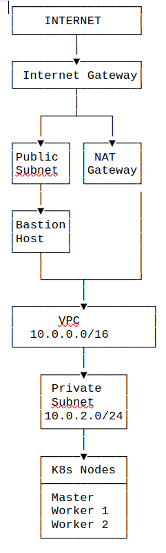

# Infrastructure Overview
Terraform configuration to deploy a secure Kubernetes cluster on AWS with isolated networking.

## Architecture Diagram


Quick Deployment
bash
## Initialize
```
terraform init
```

## Deploy
```
terraform apply
```

## Access
```
ssh -i k8s-key.pem ubuntu@$(terraform output -raw bastion_public_ip)
```
## Components
```
- VPC: 10.0.0.0/16 with public/private subnets

- Bastion Host: SSH jump box in public subnet

- K8s Cluster: 1 master + 2 workers in private subnet

- NAT Gateway: Outbound internet for private instances

- Security Groups: Minimal required ports
```
## Access Methods
- bash
## Via Bastion
```
ssh -i k8s-key.pem -J ubuntu@bastion-ip ubuntu@master-ip
```
## Direct SSM
```
aws ssm start-session --target <instance-id>
```
## Outputs
```
bastion_public_ip - SSH gateway

master_private_ip - K8s control plane

worker_private_ips - Worker nodes

vpc_id - Network identifier
```
## Ready for Kubernetes deployment via Ansible after infrastructure provisioning.

